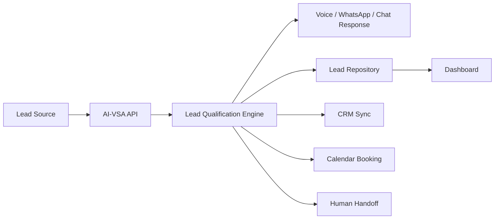

# AI-VSA

> Human-like AI sales infrastructure for calls, WhatsApp, website chat, qualification, follow-up, and appointment setting.

AI-VSA is the internal and future productized sales-agent platform for **Razex Solutions**. It is designed to handle first-contact sales conversations across voice and messaging channels, qualify prospects, collect requirements, book meetings, trigger handoffs, and help the human team focus on high-value closes.

## Why This Exists

Most businesses lose revenue in the gap between:

- a lead showing interest
- a team replying too slowly
- inconsistent qualification
- missed calls
- weak follow-up
- no unified conversation history

AI-VSA is built to close that gap with an AI sales layer that feels professional, helpful, and trustworthy.

## What The Product Does

AI-VSA is being built to:

- answer inbound calls
- place outbound qualification calls
- reply to website chat messages
- handle WhatsApp conversations
- qualify leads with structured discovery
- estimate fit and urgency
- book discovery calls
- trigger human handoff when needed
- sync lead data into CRM systems
- keep one sales memory across channels

## Product Vision

The long-term goal is not just a chatbot or voice bot.

The goal is a **multi-channel AI salesperson** that can represent Razex Solutions consistently across:

- phone calls
- website chat
- WhatsApp
- follow-up flows
- CRM-driven sales operations

Humans remain in the closing loop for larger, custom, or sensitive deals.

## Core Use Cases

| Use case | Outcome |
| --- | --- |
| Inbound call handling | Capture leads instead of missing them |
| Outbound appointment setting | Turn cold or warm lists into booked calls |
| Website chat qualification | Convert website traffic into actionable pipeline |
| WhatsApp sales assistant | Continue the same conversation on a familiar channel |
| Human handoff | Escalate serious buyers to the real team |
| CRM sync | Keep lead context and next steps organized |

## Ideal Customer Profiles

AI-VSA is designed first around sales for service businesses and automation offers such as:

- AI agents
- AI voice agents
- AI chatbots
- WhatsApp automation
- websites and conversion systems
- CRM automation
- business process automation
- custom software and SaaS

Strong early-fit client types include:

- agencies
- local service businesses
- clinics
- real estate teams
- ecommerce brands
- high-intent B2B service businesses

## How It Works



## Current Architecture

| Layer | Purpose |
| --- | --- |
| `apps/api` | Core backend, routes, provider adapters, orchestration |
| `apps/web` | Operator dashboard and internal control surface |
| `packages/agent` | Prompting, qualification logic, internal agent council |
| `packages/shared` | Shared schemas and types |
| `packages/database` | Repository abstraction for memory or Postgres/Supabase |
| `docs/` | Product, architecture, schema, and route documentation |

## Feature Status

| Area | Status | Notes |
| --- | --- | --- |
| Lead capture API | Ready | Create, update, score, and list leads |
| Conversation storage | Ready | Memory fallback plus Postgres/Supabase path |
| Dashboard API | Ready | Summary, leads, and conversation payloads |
| OpenAI chat integration | Ready | Real API path plus heuristic fallback |
| OpenAI realtime session bootstrap | Ready | Session endpoint implemented |
| Twilio outbound call adapter | Ready | Live adapter with env-based activation |
| Voice webhook handling | Ready | TwiML flow and media-stream-ready structure |
| WhatsApp adapters | Ready | Twilio, Meta, or custom API mode |
| Calendar booking adapter | Ready | Google, Calendly handoff, or custom webhook |
| CRM sync adapter | Ready | HubSpot or custom webhook |
| Persistent Postgres mode | Ready | Enabled with `DATABASE_URL` |
| Browser-verified UI pass | Pending | Needs an available browser bridge in this environment |

## Provider Strategy

The platform is intentionally built with **provider adapters** so we can optimize for cost, quality, and speed without rewriting the app.

| Capability | Primary path | Alternatives | Why |
| --- | --- | --- | --- |
| Database | Supabase Postgres | Any PostgreSQL instance | Cheap, fast, production-ready |
| AI reasoning | OpenAI | Internal heuristics fallback | Best control and strong model quality |
| Realtime voice | OpenAI Realtime + Twilio | Vapi, Retell | Lower markup and more ownership |
| Telephony | Twilio | Other SIP/voice providers later | Reliable and well documented |
| WhatsApp | Your own API or Meta Cloud API | Twilio WhatsApp | Choose based on existing approvals and control |
| Calendar | Google Calendar | Calendly, custom webhook | Fast booking flow |
| CRM | HubSpot | Custom CRM webhook | Standard business integration |

## Comparison

### AI-VSA vs basic chatbot stacks

| Category | Basic chatbot | AI-VSA |
| --- | --- | --- |
| Channels | Usually one | Multi-channel design |
| Sales flow | Generic Q&A | Qualification + booking + handoff |
| Voice | Often none | Voice-first architecture supported |
| CRM sync | Optional | Built into the product path |
| Human handoff | Weak | First-class design principle |
| Appointment setting | Sometimes manual | Built into the orchestration model |

### AI-VSA vs heavy vendor-stacked agent builds

| Category | Heavy vendor stack | AI-VSA approach |
| --- | --- | --- |
| Cost | Higher recurring markup | Tries to stay direct and lean |
| Control | Limited by vendor workflow | Greater control through adapters |
| Portability | Harder to switch | Easier to swap providers |
| Data ownership | More fragmented | Centralized app logic |
| Customization | Often constrained | Built for Razex sales motion |

## Repository Structure

```text
apps/
  api/
  web/
packages/
  agent/
  database/
  shared/
docs/
scripts/
```

## API Highlights

| Route | Purpose |
| --- | --- |
| `GET /health` | Service health and storage mode |
| `GET /api/config` | Runtime provider mode summary |
| `GET /api/dashboard` | Dashboard payload for leads and conversations |
| `POST /leads` | Create a lead |
| `PATCH /leads/:id` | Update a lead |
| `POST /chat/message` | Run chat qualification flow |
| `POST /api/calls/outbound` | Trigger outbound call flow |
| `POST /webhooks/voice` | Voice webhook handler |
| `GET /webhooks/whatsapp` | WhatsApp verification |
| `POST /webhooks/whatsapp` | WhatsApp inbound processing |
| `POST /agent/tools/book-meeting` | Book a meeting through provider adapters |
| `POST /api/realtime/session` | Bootstrap OpenAI realtime session |

More detail is available in [docs/api-routes.md](C:/Users/essar/OneDrive/Documents/VOICE%20AGENT%20FOR%20SALES/docs/api-routes.md:1).

## Tech Stack

| Area | Stack |
| --- | --- |
| Runtime | Node.js + TypeScript |
| API | Express |
| Validation | Zod |
| Frontend | Vite + TypeScript |
| Database | PostgreSQL / Supabase |
| AI | OpenAI Responses + Realtime |
| Telephony | Twilio |
| Messaging | Twilio WhatsApp, Meta Cloud API, or custom API |
| CRM | HubSpot or custom webhook |
| Calendar | Google Calendar, Calendly, or custom webhook |
| Python sidecar | Optional utilities via local `.venv` |

## Environment Overview

Key variables are documented in [.env.example](C:/Users/essar/OneDrive/Documents/VOICE%20AGENT%20FOR%20SALES/.env.example:1).

Important groups:

- `DATABASE_URL`
- `OPENAI_API_KEY`
- `TWILIO_*`
- `WHATSAPP_*`
- `GOOGLE_CALENDAR_*`
- `HUBSPOT_ACCESS_TOKEN`
- `CUSTOM_*` webhook fallback variables

## Quick Start

### 1. Install dependencies

```bash
npm install
```

### 2. Create local environment files

Copy `.env.example` to `.env` and add the providers you want to use.

### 3. Create the Python virtual environment

```powershell
powershell -ExecutionPolicy Bypass -File .\scripts\setup_venv.ps1
```

### 4. Start the API

```bash
npm run dev:api
```

### 5. Start the dashboard

```bash
npm run dev:web
```

### 6. Build the project

```bash
npm run build
```

### 7. Typecheck the project

```bash
npm run typecheck
```

## Supabase / Postgres Setup

If you want persistence:

1. Create a Supabase project or any Postgres database.
2. Apply [docs/supabase-schema.sql](C:/Users/essar/OneDrive/Documents/VOICE%20AGENT%20FOR%20SALES/docs/supabase-schema.sql:1).
3. Set `DATABASE_URL` in `.env`.
4. Restart the API.

If `DATABASE_URL` is missing, the app falls back to in-memory storage for local development.

## Roadmap

### Near term

- connect real Supabase project
- connect real OpenAI API key
- connect Twilio voice number
- connect WhatsApp provider of choice
- connect Google Calendar or Calendly
- connect HubSpot or custom CRM webhook

### Mid term

- conversation analytics
- campaign scoring
- transcript evaluation
- operator workflows
- multi-client tenancy

### Long term

- cross-channel memory
- richer outbound campaign tooling
- channel expansion beyond phone and WhatsApp
- deeper human closer workflow support

## Documentation

| File | Purpose |
| --- | --- |
| [docs/architecture.md](C:/Users/essar/OneDrive/Documents/VOICE%20AGENT%20FOR%20SALES/docs/architecture.md:1) | Technical architecture |
| [docs/api-routes.md](C:/Users/essar/OneDrive/Documents/VOICE%20AGENT%20FOR%20SALES/docs/api-routes.md:1) | Route and provider overview |
| [docs/implementation-roadmap.md](C:/Users/essar/OneDrive/Documents/VOICE%20AGENT%20FOR%20SALES/docs/implementation-roadmap.md:1) | Build priorities and cost strategy |
| [docs/sales-playbook.md](C:/Users/essar/OneDrive/Documents/VOICE%20AGENT%20FOR%20SALES/docs/sales-playbook.md:1) | Sales framing and qualification approach |
| [docs/supabase-schema.sql](C:/Users/essar/OneDrive/Documents/VOICE%20AGENT%20FOR%20SALES/docs/supabase-schema.sql:1) | Database schema bootstrap |

## Contributing

Please read [CONTRIBUTING.md](C:/Users/essar/OneDrive/Documents/VOICE%20AGENT%20FOR%20SALES/CONTRIBUTING.md:1) before opening large changes or provider integrations.

## Courses / Learning Path

If someone new joins the project, this is the recommended onboarding sequence:

| Order | Focus |
| --- | --- |
| 1 | Read this README end to end |
| 2 | Read the architecture and roadmap docs |
| 3 | Understand the lead and conversation schemas |
| 4 | Learn the provider adapter model |
| 5 | Run the API in memory mode |
| 6 | Connect a real Postgres or Supabase instance |
| 7 | Connect one real channel at a time |

## License

This repository currently uses a **proprietary, all-rights-reserved** license suitable for a commercial product in active development. See [LICENSE](C:/Users/essar/OneDrive/Documents/VOICE%20AGENT%20FOR%20SALES/LICENSE:1).

If you want to open-source AI-VSA later, the license can be switched to MIT, Apache-2.0, or another model.

## Contact / Ownership

Built for **Razex Solutions** as the foundation for an internal AI sales assistant and a future client-facing platform.
