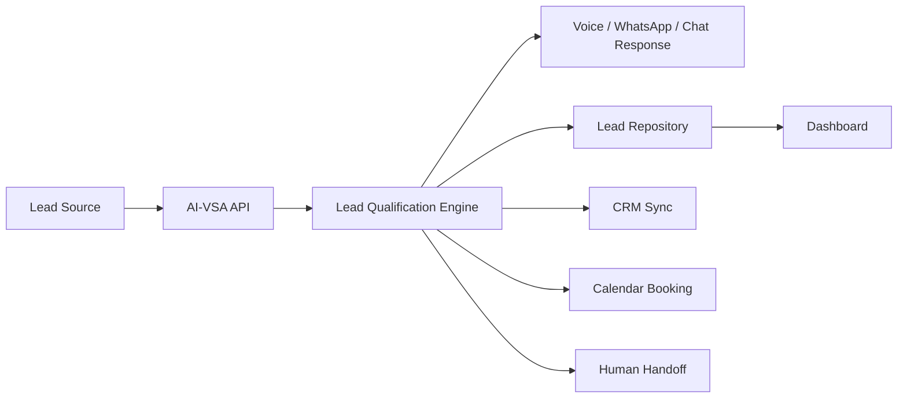

# 🤖 AI-VSA

> **Human-like AI Sales Infrastructure for Multi-Channel Lead Engagement**
> 
> Automate inbound calls, WhatsApp conversations, website chat, lead qualification, follow-ups, and appointment setting—all in one intelligent platform.

---

## 🎯 Why This Exists

Most businesses lose revenue in the gap between:

- 📞 A lead showing interest
- ⏱️ The team replying too slowly
- 🎯 Inconsistent qualification
- 📱 Missed calls and messages
- 📋 Weak follow-up systems
- 🔄 No unified conversation history

**AI-VSA closes that gap** with an AI sales layer that feels professional, helpful, and trustworthy.

---

## ✨ What The Product Does

AI-VSA is being built to:

- ☎️ Answer inbound calls with AI intelligence
- 📞 Place outbound qualification calls automatically
- 💬 Reply to website chat messages in real-time
- 📲 Handle WhatsApp conversations seamlessly
- 🔍 Qualify leads with structured discovery
- 📊 Estimate fit and urgency automatically
- 📅 Book discovery calls and appointments
- 👤 Trigger human handoff when needed
- 🗄️ Sync lead data into CRM systems
- 🧠 Keep one sales memory across all channels

---

## 🚀 Product Vision

The long-term goal is **not just a chatbot or voice bot**.

The goal is a **multi-channel AI salesperson** that can represent your business consistently across:

- ☎️ Phone calls
- 💬 Website chat
- 📱 WhatsApp
- 📧 Follow-up flows
- 🏢 CRM-driven sales operations

👥 *Humans remain in the closing loop for larger, custom, or sensitive deals.*

---

## 💼 Core Use Cases

| Use case | Outcome |
| --- | --- |
| 📞 Inbound call handling | Capture leads instead of missing them |
| 📤 Outbound appointment setting | Turn cold or warm lists into booked calls |
| 🌐 Website chat qualification | Convert website traffic into actionable pipeline |
| 💬 WhatsApp sales assistant | Continue the same conversation on a familiar channel |
| 🔀 Human handoff | Escalate serious buyers to the real team |
| 🗂️ CRM sync | Keep lead context and next steps organized |

---

## 👥 Ideal Customer Profiles

AI-VSA is designed first around sales for service businesses and automation offers such as:

- 🤖 AI agents & AI voice agents
- 🤝 Chatbots & WhatsApp automation
- 🌍 Websites and conversion systems
- 📊 CRM & business process automation
- 💻 Custom software and SaaS

**Strong early-fit client types:**
- Agencies & Digital Studios
- Local Service Businesses
- Clinics & Healthcare
- Real Estate Teams
- eCommerce Brands
- High-intent B2B Service Businesses

---

## 🏗️ How It Works



---

## 🏛️ Current Architecture

| Layer | Purpose |
| --- | --- |
| 🔌 `apps/api` | Core backend, routes, provider adapters, orchestration |
| 🖥️ `apps/web` | Operator dashboard and internal control surface |
| 🧠 `packages/agent` | Prompting, qualification logic, internal agent council |
| 🔀 `packages/shared` | Shared schemas and types |
| 💾 `packages/database` | Repository abstraction for memory or Postgres/Supabase |
| 📚 `docs/` | Product, architecture, schema, and route documentation |

---

## 📋 Feature Status

| Area | Status | Notes |
| --- | --- | --- |
| Lead capture API | ✅ Ready | Create, update, score, and list leads |
| Conversation storage | ✅ Ready | Memory fallback plus Postgres/Supabase path |
| Dashboard API | ✅ Ready | Summary, leads, and conversation payloads |
| OpenAI chat integration | ✅ Ready | Real API path plus heuristic fallback |
| OpenAI realtime session bootstrap | ✅ Ready | Session endpoint implemented |
| Twilio outbound call adapter | ✅ Ready | Live adapter with env-based activation |
| Voice webhook handling | ✅ Ready | TwiML flow and media-stream-ready structure |
| WhatsApp adapters | ✅ Ready | Twilio, Meta, or custom API mode |
| Calendar booking adapter | ✅ Ready | Google, Calendly handoff, or custom webhook |
| CRM sync adapter | ✅ Ready | HubSpot or custom webhook |
| Persistent Postgres mode | ✅ Ready | Enabled with `DATABASE_URL` |
| Browser-verified UI pass | ⏳ Pending | Needs an available browser bridge in this environment |

---

## 🔄 Provider Strategy

The platform is intentionally built with **provider adapters** so we can optimize for cost, quality, and speed without rewriting the app.

| Capability | Primary path | Alternatives | Why |
| --- | --- | --- | --- |
| Database | Supabase Postgres | Any PostgreSQL instance | Cheap, fast, production-ready |
| AI reasoning | OpenAI | Internal heuristics fallback | Best control and strong model quality |
| Realtime voice | OpenAI Realtime + Twilio | Vapi, Retell | Lower markup and more ownership |
| Telephony | Twilio | Other SIP/voice providers later | Reliable and well documented |
| WhatsApp | Your own API or Meta Cloud API | Twilio WhatsApp | Choose based on existing approvals and control |
| Calendar | Google Calendar | Calendly, custom webhook | Fast booking flow |
| CRM | HubSpot | Custom CRM webhook | Standard business integration |

---

## 🆚 Comparison

### AI-VSA vs basic chatbot stacks

| Category | Basic chatbot | AI-VSA |
| --- | --- | --- |
| Channels | Usually one | Multi-channel design |
| Sales flow | Generic Q&A | Qualification + booking + handoff |
| Voice | Often none | Voice-first architecture supported |
| CRM sync | Optional | Built into the product path |
| Human handoff | Weak | First-class design principle |
| Appointment setting | Sometimes manual | Built into the orchestration model |

### AI-VSA vs heavy vendor-stacked agent builds

| Category | Heavy vendor stack | AI-VSA approach |
| --- | --- | --- |
| Cost | Higher recurring markup | Tries to stay direct and lean |
| Control | Limited by vendor workflow | Greater control through adapters |
| Portability | Harder to switch | Easier to swap providers |
| Data ownership | More fragmented | Centralized app logic |
| Customization | Often constrained | Built for Razex sales motion |

---

## 📂 Repository Structure

```
ai-vsa/
├── apps/
│   ├── api/                    # Express backend & orchestration
│   └── web/                    # Vite + TypeScript dashboard
├── packages/
│   ├── agent/                  # AI prompting & qualification logic
│   ├── database/               # Repository abstraction
│   └── shared/                 # Shared schemas & types
├── docs/                       # Architecture & implementation docs
├── scripts/                    # Setup & utility scripts
├── .env.example               # Environment template
└── LICENSE                     # Proprietary license
```

---

## 🔌 API Highlights

| Route | Purpose |
| --- | --- |
| `GET /health` | Service health and storage mode |
| `GET /api/config` | Runtime provider mode summary |
| `GET /api/dashboard` | Dashboard payload for leads and conversations |
| `POST /leads` | Create a lead |
| `PATCH /leads/:id` | Update a lead |
| `POST /chat/message` | Run chat qualification flow |
| `POST /api/calls/outbound` | Trigger outbound call flow |
| `POST /webhooks/voice` | Voice webhook handler |
| `GET /webhooks/whatsapp` | WhatsApp verification |
| `POST /webhooks/whatsapp` | WhatsApp inbound processing |
| `POST /agent/tools/book-meeting` | Book a meeting through provider adapters |
| `POST /api/realtime/session` | Bootstrap OpenAI realtime session |

📖 More detail is available in [docs/api-routes.md](./docs/api-routes.md).

---

## 🛠️ Tech Stack

| Area | Stack |
| --- | --- |
| 🚀 Runtime | Node.js + TypeScript |
| 🔌 API | Express |
| ✔️ Validation | Zod |
| 🎨 Frontend | Vite + TypeScript |
| 💾 Database | PostgreSQL / Supabase |
| 🧠 AI | OpenAI Responses + Realtime |
| ☎️ Telephony | Twilio |
| 📱 Messaging | Twilio WhatsApp, Meta Cloud API, or custom API |
| 🏢 CRM | HubSpot or custom webhook |
| 📅 Calendar | Google Calendar, Calendly, or custom webhook |
| 🐍 Python sidecar | Optional utilities via local `.venv` |

---

## ⚙️ Environment Overview

Key variables are documented in [.env.example](./.env.example).

Important groups:

- `DATABASE_URL` — PostgreSQL or Supabase connection
- `OPENAI_API_KEY` — OpenAI API credentials
- `TWILIO_*` — Twilio voice & SMS configuration
- `WHATSAPP_*` — WhatsApp provider settings
- `GOOGLE_CALENDAR_*` — Google Calendar integration
- `HUBSPOT_ACCESS_TOKEN` — HubSpot CRM sync
- `CUSTOM_*` — Webhook fallback variables

---

## 🚀 Quick Start

### 1. Install dependencies

```bash
npm install
```

### 2. Create local environment files

Copy `.env.example` to `.env` and add the providers you want to use.

### 3. Create the Python virtual environment

```powershell
powershell -ExecutionPolicy Bypass -File .\scripts\setup_venv.ps1
```

### 4. Start the API

```bash
npm run dev:api
```

### 5. Start the dashboard

```bash
npm run dev:web
```

### 6. Build the project

```bash
npm run build
```

### 7. Typecheck the project

```bash
npm run typecheck
```

---

## 🗄️ Supabase / Postgres Setup

If you want persistence:

1. Create a Supabase project or any Postgres database.
2. Apply [docs/supabase-schema.sql](./docs/supabase-schema.sql).
3. Set `DATABASE_URL` in `.env`.
4. Restart the API.

If `DATABASE_URL` is missing, the app falls back to in-memory storage for local development.

---

## 🗺️ Roadmap

### 📍 Near term

- ✅ Connect real Supabase project
- ✅ Connect real OpenAI API key
- ✅ Connect Twilio voice number
- ✅ Connect WhatsApp provider of choice
- ✅ Connect Google Calendar or Calendly
- ✅ Connect HubSpot or custom CRM webhook

### 📍 Mid term

- 🔄 Conversation analytics
- 📊 Campaign scoring
- 📝 Transcript evaluation
- ⚙️ Operator workflows
- 🏢 Multi-client tenancy

### 📍 Long term

- 🧠 Cross-channel memory
- 📢 Richer outbound campaign tooling
- 🌍 Channel expansion beyond phone and WhatsApp
- 👥 Deeper human closer workflow support

---

## 📚 Documentation

| File | Purpose |
| --- | --- |
| [docs/architecture.md](./docs/architecture.md) | Technical architecture deep dive |
| [docs/api-routes.md](./docs/api-routes.md) | Route and provider overview |
| [docs/implementation-roadmap.md](./docs/implementation-roadmap.md) | Build priorities and cost strategy |
| [docs/sales-playbook.md](./docs/sales-playbook.md) | Sales framing and qualification approach |
| [docs/supabase-schema.sql](./docs/supabase-schema.sql) | Database schema bootstrap |

---

## 🤝 Contributing

Please read [CONTRIBUTING.md](./CONTRIBUTING.md) before opening large changes or provider integrations.

---

## 📖 Courses / Learning Path

If someone new joins the project, this is the recommended onboarding sequence:

| Order | Focus |
| --- | --- |
| 1️⃣ | Read this README end to end |
| 2️⃣ | Read the architecture and roadmap docs |
| 3️⃣ | Understand the lead and conversation schemas |
| 4️⃣ | Learn the provider adapter model |
| 5️⃣ | Run the API in memory mode |
| 6️⃣ | Connect a real Postgres or Supabase instance |
| 7️⃣ | Connect one real channel at a time |

---

## 📜 License

This repository currently uses a **proprietary, all-rights-reserved** license suitable for a commercial product in active development. See [LICENSE](./LICENSE).

If you want to open-source AI-VSA later, the license can be switched to MIT, Apache-2.0, or another model.

---

## 👥 Contact / Ownership

Built for **Razex Solutions** as the foundation for an internal AI sales assistant and a future client-facing platform.

---

## 🔗 Resources & Sources

### Core APIs & Services

| Service | Purpose | Website |
| --- | --- | --- |
| **OpenAI** | AI reasoning, chat, and realtime voice | https://openai.com |
| **Twilio** | Telephony, SMS, and WhatsApp integration | https://www.twilio.com |
| **Supabase** | PostgreSQL database and backend | https://supabase.com |
| **HubSpot** | CRM and sales platform | https://www.hubspot.com |
| **Meta Cloud API** | WhatsApp business messaging | https://www.meta.com/business |
| **Google Calendar** | Calendar and appointment management | https://calendar.google.com |
| **Calendly** | Calendar scheduling platform | https://calendly.com |

### Development Tools

| Tool | Purpose | Website |
| --- | --- | --- |
| **Node.js** | JavaScript runtime | https://nodejs.org |
| **Express** | Web framework | https://expressjs.com |
| **TypeScript** | Static typing for JavaScript | https://www.typescriptlang.org |
| **Vite** | Frontend build tool | https://vitejs.dev |
| **Zod** | Schema validation library | https://zod.dev |
| **PostgreSQL** | Database management system | https://www.postgresql.org |

### Additional Integrations

| Service | Purpose | Website |
| --- | --- | --- |
| **Vapi** | Alternative voice provider | https://vapi.ai |
| **Retell** | Voice AI platform | https://retell.cc |
| **Mermaid** | Diagram and flowchart generation | https://mermaid.js.org |

---

**Made with ❤️ by Razex Solutions**
